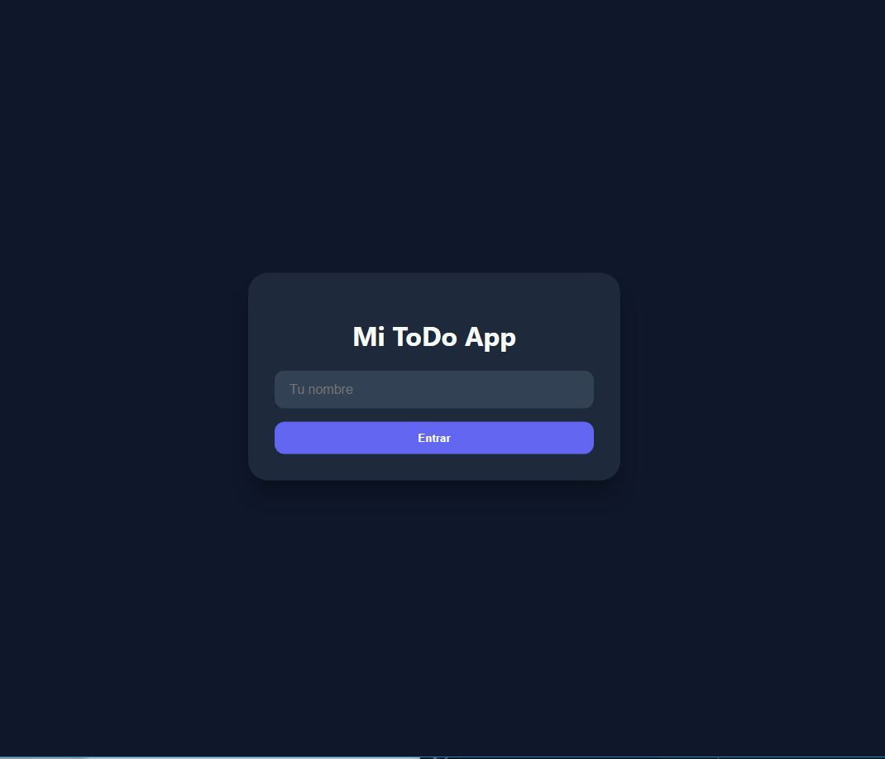
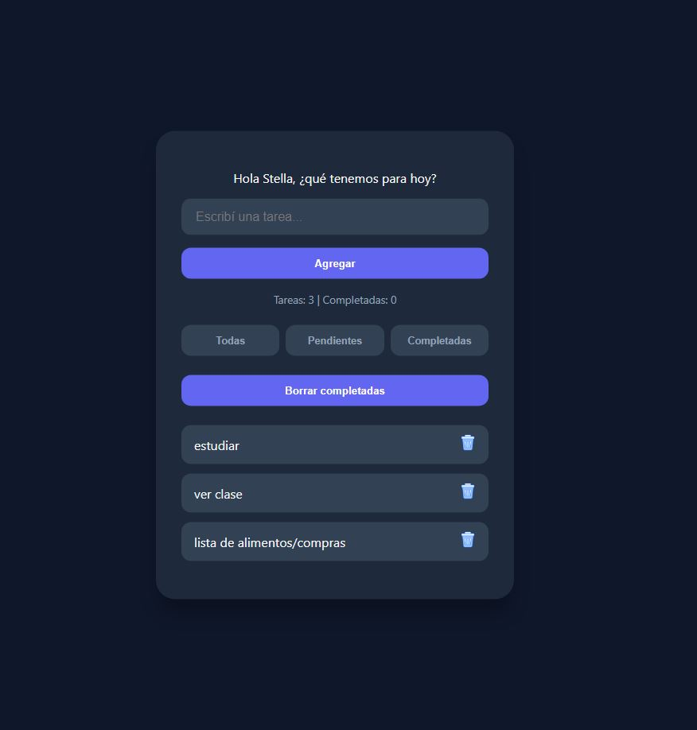

# 📝 Mi ToDo App - Moderna & Responsive

Una aplicación de lista de tareas (To-Do List) diseñada con un enfoque en la experiencia de usuario, estética moderna y adaptabilidad total a dispositivos móviles.

## 🚀 Características

- **Login Simpático:** Pantalla de bienvenida que personaliza la experiencia con tu nombre.
- **Persistencia de Datos:** Uso de `localStorage` para que tus tareas y tu nombre no se borren al cerrar el navegador.
- **Gestión de Tareas:** Crear, completar y eliminar tareas con confirmación de seguridad.
- **Filtros Inteligentes:** Visualizá todas las tareas, solo las pendientes o las completadas.
- **Diseño Responsive:** Optimizado especialmente para móviles  
- **Interfaz Moderna:** Animaciones de entrada (`fadeIn`), transiciones suaves entre pantallas y modo oscuro.

## 🛠️ Tecnologías utilizadas

- **HTML5:** Estructura semántica.
- **CSS3:** Flexbox, Grid, Animaciones (@keyframes) y Media Queries para Mobile.
- **JavaScript (Vanilla):** Lógica de manipulación del DOM, manejo de Arrays y almacenamiento local.

## 📱 Capturas de pantalla

## ✒️ Autor

[**Stella M. Loreto**](https://github.com/stellamarisl)
